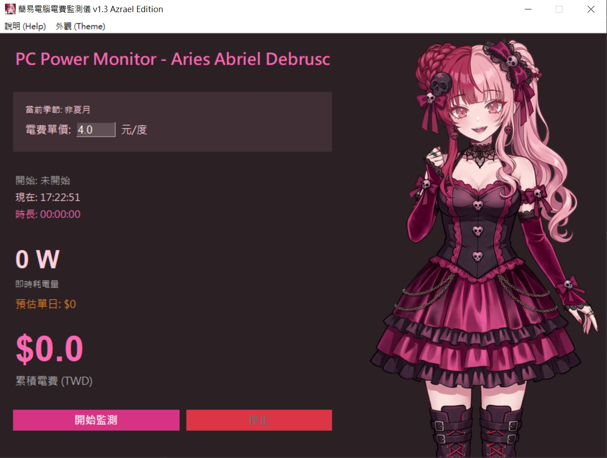

# 簡易電腦電費監測儀 (Simple PC Power Monitor) - Azrael Edition


一個結合動漫風格介面與實用功能的 Windows 電源監測工具。
A stylish Windows desktop tool for real-time PC power monitoring, featuring the character **Azrael**.

<!-- 請確認您有上傳截圖，並將檔名改為 screenshot.png (或 jpg) -->


## ✨ 版本特色 (v1.3 Azrael Edition)

*   **Azrael GUI 介面**：動態載入角色立繪，視窗右側展示專屬看板娘 Azrael。
*   **多樣化主題 (Themes)**：
    *   🌑 **Azrael Dark**：深紫黑風格 (預設)
    *   🌸 **Azrael Light**：薰衣草粉風格
    *   🖥️ **System Sync**：自動跟隨 Windows 系統深/淺色設定
*   **即時監測**：精準讀取 CPU 與 GPU 功耗 (Powered by LibreHardwareMonitor)。
*   **電費試算**：
    *   即時換算累積電費 (TWD)。
    *   **單日預估**：依照當前負載，推算掛機 24 小時所需電費。
*   **聰明費率**：自動判斷台灣「夏月」(6-9月) 與「非夏月」建議電價。

## 🚀 下載與使用 (Download & Usage)

1.  前往 [Releases](https://github.com/irosdp/Electricity-bill-calculation/releases) 下載最新版本的 `run.exe` (或壓縮包)。
2.  **右鍵 -> 以系統管理員身分執行** (Run as Administrator)。
    *   *注意：必須使用管理員權限，否則無法讀取硬體傳感器數據。*

## 🛠️ 開發環境 (Development)

如果您想自行修改原始碼，請參考以下步驟：

### 需求 (Prerequisites)
*   Python 3.12+
*   必要的 Python 套件：`pythonnet`, `pillow`, `pyinstaller`
*   **LibreHardwareMonitorLib.dll** (需放在專案根目錄)

### 建置指令 (Build)
使用 PyInstaller 打包 (包含圖片與 DLL)：
```bash
py -m PyInstaller --onefile --noconsole --uac-admin --icon="icon.ico" --add-data "LibreHardwareMonitorLib.dll;." --add-data "character.png;." --add-data "icon.ico;." run.py```

## ⚠️ 免責聲明 (Disclaimer)

1.  **估算性質**：數值基於 CPU/GPU 傳感器回報之 DC 功耗 + 預設周邊 (50W) / 預設電源效率 (80%) 計算。
2.  **物理限制**：軟體無法偵測螢幕、喇叭等外部設備耗電，亦無法得知 PSU 實際轉換效率。
3.  **僅供參考**：實際電費請以台電帳單為準。

## 📜 授權與致謝 (License & Credits)

### 本專案授權 (Project License)
本軟體採用 **GNU General Public License v3.0 (GPLv3)** 授權。
這是一份自由軟體，歡迎您在遵守 GPL 規範的前提下修改與分享。
This software is licensed under the **GNU GPLv3**.

### 第三方函式庫 (Third-Party Libraries)
本軟體使用 **LibreHardwareMonitor** 進行硬體監控。
This project uses the **LibreHardwareMonitor** library for hardware monitoring.

*   **Library**: [LibreHardwareMonitor](https://github.com/LibreHardwareMonitor/LibreHardwareMonitor)
*   **License**: Mozilla Public License 2.0 (MPL 2.0)
*   **Copyright**: Copyright © LibreHardwareMonitor and Contributors.

---
**Author**: Aries Abriel Debrusc
**Contact**: irosdp@gmail.com

